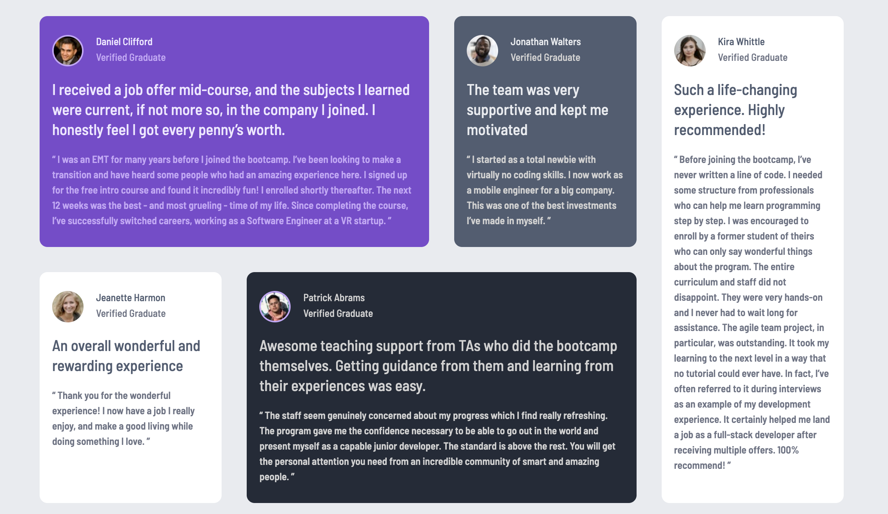

# Frontend Mentor - Testimonials grid section solution

This is a solution to the [Testimonials grid section challenge on Frontend Mentor](https://www.frontendmentor.io/challenges/testimonials-grid-section-Nnw6J7Un7).

## Table of contents

- [Overview](#overview)
  - [The challenge](#the-challenge)
  - [Screenshot](#screenshot)
  - [Links](#links)
- [My process](#my-process)
  - [Built with](#built-with)
  - [What I learned](#what-i-learned)

- [Author](#author)

## Overview

### The challenge

Users should be able to:

- View the optimal layout for the site depending on their device's screen size

### Screenshot

### Links

- Solution URL: [GitHub](https://github.com/piyush-kaushik24/testimonials-grid-section)
- Live Site URL: [Testimonials grid section](https://piyush-kaushik24.github.io/testimonials-grid-section/)

## My process

### Built with

- Semantic HTML5 markup
- CSS custom properties
- Flexbox
- CSS Grid
- Mobile-first workflow

### What I learned
- Building responsive layouts using CSS Grid.
- Using `grid-template-columns` and fractional units (`fr`).
- Positioning elements with `grid-column` and `grid-row`.
- Creating layouts that adapt from a mobile-first Flexbox layout to a desktop Grid layout.
- Using `grid-auto-rows` to let rows size based on their content.
- Using media queries to change layout at different viewport sizes.
- Structuring reusable components with shared classes and modifier classes.

## Author

- Website - [@piyush-kaushik24](https://github.com/piyush-kaushik24)
- Frontend Mentor - [@piyush-kaushik24](https://www.frontendmentor.io/profile/piyush-kaushik24)
